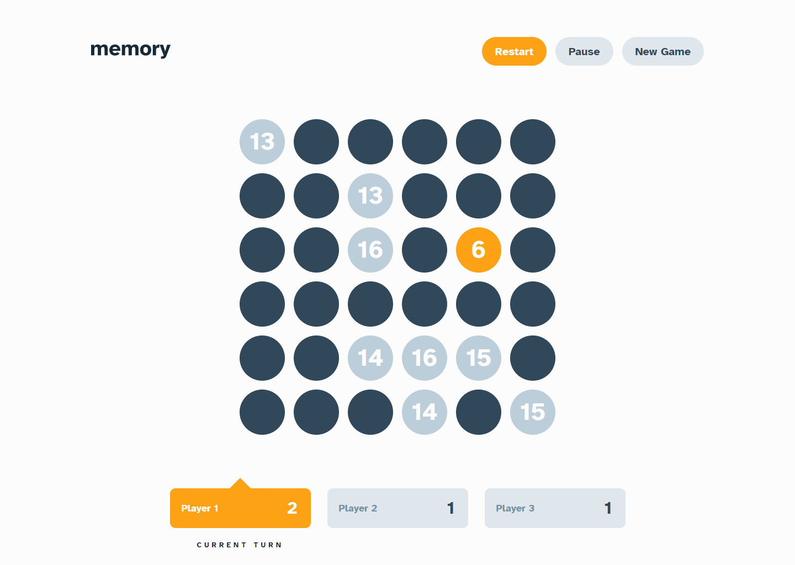

# Frontend Mentor - Memory game solution

This is a solution to the [Memory game challenge on Frontend Mentor](https://www.frontendmentor.io/challenges/memory-game-vse4WFPvM). Frontend Mentor challenges help you improve your coding skills by building realistic projects. 

## Table of contents

- [Overview](#overview)
  - [The challenge](#the-challenge)
  - [Screenshot](#screenshot)
  - [Links](#links)
- [My process](#my-process)
  - [Built with](#built-with)
  - [What I learned](#what-i-learned)
    - [Dialog](#dialog)
    - [Store management](#store-managemenet)
  - [Continued development](#continued-development)
- [Author](#author)

## Overview

### The challenge

Users should be able to:

- View the optimal layout for the game depending on their device's screen size
- See hover states for all interactive elements on the page
- Play the Memory game either solo or multiplayer (up to 4 players)
- Set the theme to use numbers or icons within the tiles
- Choose to play on either a 6x6 or 4x4 grid

### Screenshot



### Links

- Solution URL: [Add solution URL here](https://your-solution-url.com)
- Live Site URL: [https://fem-memory-game-mlongobardi.vercel.app/](https://fem-memory-game-mlongobardi.vercel.app/)

## My process

### Built with

- Semantic HTML5 markup
- CSS custom properties
- Flexbox
- CSS Grid
- Mobile-first workflow
- [Svelte](https://svelte.dev/) - JS framework
- [Sveltekit](https://kit.svelte.dev/) - Svelte framework
- [Sass](https://sass-lang.com/) - For styles
- [Autoprefixer (PostCSS)](https://github.com/postcss/autoprefixer) - For styles

### What I learned
After what I learned in my previous Frontend Mentor projects, this one was pretty straightforward, so I spent some time to work on my Dialog.svelte and my management of the application state with Svelte's stores.

#### Dialog
Dialog.svelte creates a [\<dialog\>](https://developer.mozilla.org/en-US/docs/Web/HTML/Element/dialog) element that can (optionally) close itself when clicking or tapping on the backdrop, and can run a custom function on both open and close. When created with the "name" attribute, that instance is added to a store (dialogStore), and can be easily accessed by any other component, without having to pass a reference through props. For example:
```html
<!--ComponentA-->
<script>
    function settingsOpen() {
        /*...*/
    }
    function settingsClose() {
        /*...*/
    }
</script>

<Dialog name="SETTINGS" onOpen={settingsOpen} onClose={settingsClose}>
    <div class="settings">
        <!-- settings content -->
    </div>
</Dialog>
```
And:
```html
<!--ComponentB-->
<script>
    import { dialogStore } from "(dialogStore-path)";
</script>

<button on:click={$dialogStore.SETTINGS.close}>
    Close Settings
</button>
```
The button in ComponentB will close the settings dialog even if it's in another component, and the dialog will run the settingsClose() function before closing (for example in this project, opening and closing the pause dialog will stop and resume the game timer).

#### Store management
Svelte provides stores: objects that components can subscribe to, updating whenever the store value changes. The standard, writable stores come with a set (overwrite store value) and an update (change store value depending on previous state) methods. This means that any component can change the store value, and all other components that subscribe to the same store will be correctly updated. These may work when the value is a simple, single variable, but when using a complex object that makes up the application state (or part of it), I like making a custom store with my own methods, so that I can precisely control how the state is changed. In this project, I improved the way I do this, removing some boilerplate.

Previously, my implementation of a store looked like this:

```js
import { writable } from "svelte/store";

//the application state, with the initial values before anything modifies them
const cleanState = {
	propertyA: "hello ",
	propertyB: {
		one: 1,
		two: 2,
	},
	propertyC: "world",
	get fullString() {return this.propertyA + this.propertyC}
}

const tempStore = writable(cleanState); //the store is created and initialized with cleanState

//add my custom methods
tempStore.methodA = (argumentA) => {
	tempStore.update((draft) => { //each one needs to internally call the update method
		draft.propertyB.one += argumentA;
		return draft; //and it must return the modified draft
	});
	tempStore.methodHidden();
};

tempStore.methodHidden = () => {
    //this method should only be usable by other store methods 
    //not by outside components that subscribe to the store
	tempStore.update((draft) => { //two extra lines may not seem much
		/*do something to draft*/
		return draft; //but they add up 
	})
}

//use object destructuring to create a copy of tempStore that doesn't have set and update, and export it
export const { set, update, methodHidden, ...actualStore } = tempStore;
```
The more complex an application is, the more cleanState and the list of custom methods grow, resulting in a pretty long file that is difficult to navigate. Also if I want some methods to remain implicit, I need to remember to manually add them to the list of excluded methods in the last line.

[In my new approach](https://github.com/MLongobardi/FEM-memory-game/tree/main/src/lib/stores), I created an initializeStore function (in the utility folder) that takes a store and a set of methods as arguments. The methods are [bound](https://developer.mozilla.org/en-US/docs/Web/JavaScript/Reference/Global_Objects/Function/bind) to the store so that they can use the "this" keyword to call other methods, and methods that start with an underscore ("\_") will remain implicit. The function then returns the correctly created store.

My dialogStore now looks like this:
```js
/* stores/methods/dialogStore.js */
export function addInstance(draft, name, instance) {
	draft[name] = {
		open() {
			instance.myShowModal();
		},
		close() {
			instance.myClose();
		},
	};
}

export function removeInstance(draft, name) {
	delete draft[name];
}
```
And:
```js
/* stores/dialogStore.js */
import { writable } from "svelte/store";
import initializeStore from "./utility/initializeStore.js";
import * as dialogStoreMethods from "./methods/dialogStore.js";

const startObject = {};

const dialogStore = initializeStore(writable(startObject), dialogStoreMethods);
export default dialogStore;
```
Which is faster to write and looks much better.

### Continued development

Working on Dialog.svelte made me understand the importance of having abstract components that can be reused for different projects. Having a library of them would really speed up the creation of a project, so I will try to make some more.

I'm not completely sold on the naming convention I chose for the store method files, having the same name as the store they're meant for. While the two files are in different folders, they end up close in the VS Code sidebar which makes it easy to confuse them. I'll see if I can get used to it, or if I should find another way to name them.

## Author

- GitHub - [@MLongobardi](https://github.com/MLongobardi)
- Frontend Mentor - [@MLongobardi](https://www.frontendmentor.io/profile/MLongobardi)